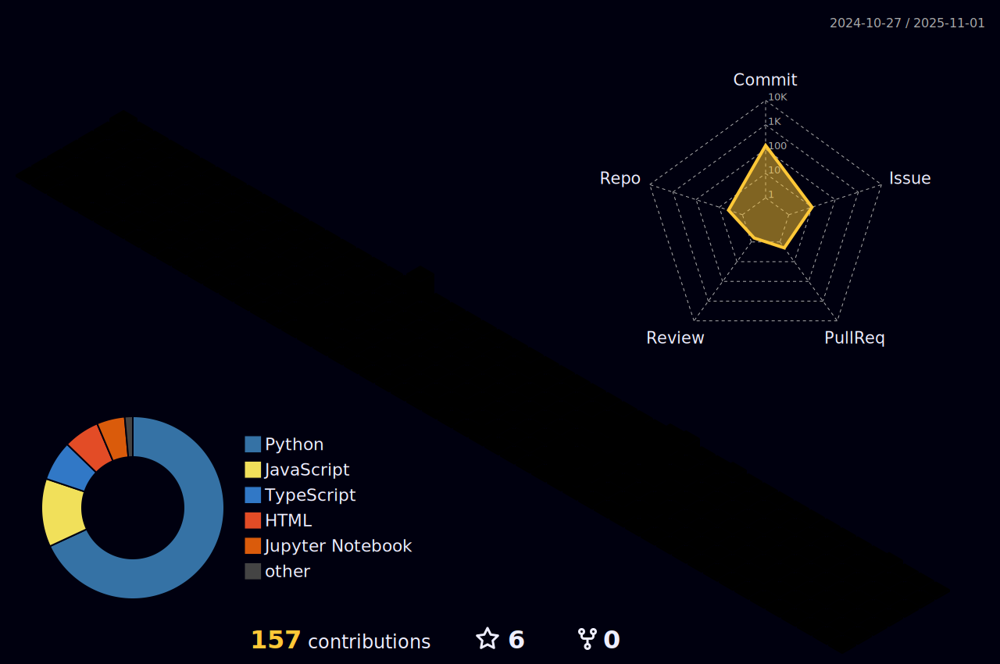

<!-- []
-->

<!--
**Rrocketter/Rrocketter** is a ✨ _special_ ✨ repository because its `README.md` (this file) appears on your GitHub profile.

Here are some ideas to get you started:

- 🔭 I’m currently working on ...
- 🌱 I’m currently learning ...
- 👯 I’m looking to collaborate on ...
- 🤔 I’m looking for help with ...
- 💬 Ask me about ...
- 📫 How to reach me: ...
- 😄 Pronouns: ...
- ⚡ Fun fact: ...
-->

<h1 align="center">Hi 👋, I'm Rahul Gupta</h1>
<h3 align="center">Sophomore at HTHS</h3>

 <!-- - 🔭 I’m currently working on **RG-Lang** -->

- 🌱 I’m currently learning **Deep Learning & Neural Nets**

- 👨‍💻 All of my projects are available at [rgupta.vercel.app](rgupta.vercel.app)

- 📝 I regularly write articles on [rahulrocket711.wordpress.com](rahulrocket711.wordpress.com)

<h3 align="left">Connect with me:</h3>

 <!-- <h3 align="left">Languages and Tools:</h3>

                              
 -->

